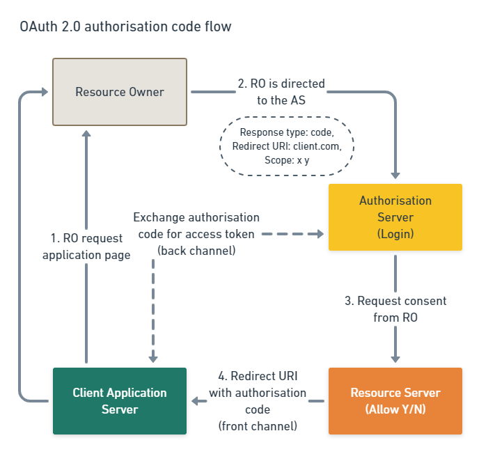

# Learning OAuth 2.0 and OpenID Connect


## What I have understood as I have begun to learn about OAuth 2.0 and OpenID Connect

### [OAuth 2.0 and OpenID Connect (in plain English)](https://www.youtube.com/watch?v=996OiexHze0)

Solves the Yelp problem (I want to know your Gmail contacts, give me your email
address and password)!

- Resource owner (the user)
- Client (an application)
- Authorisation server (Google)
- Resource server (Google contacts)
- Authorisation grant (roles)
- Redirect URI (where on the application to return the user)
- Access token (the permission to do what I need to do)



Client -> Resource owner

Resource owner -> Authorisation server

Authorisation server -> Resource server

Resource server -> Redirect URI

Redirect URI -> Authorisation server (request token)

Authorisation server -> Redirect URI (token)

### Auth0 React tutorial

Following the
[Auth0 React tutorial](https://auth0.com/docs/quickstart/spa/react/01-login),
and learned about how to configure an [Auth0 application]() and then about the
[Auth0 React SDK]().

#### Sample application setup

#### TDD

https://www.nuomiphp.com/eplan/en/2884.html to show me how to mock destructured
imports with Jest.

```JavaScript
jest.mock('@auth0/auth0-react');

import { useAuth0 } from '@auth0/auth0-react';

useAuth0.mockReturnValue({
  user: null,
  isAuthenticated: false,
  isLoading: false,
});
```
